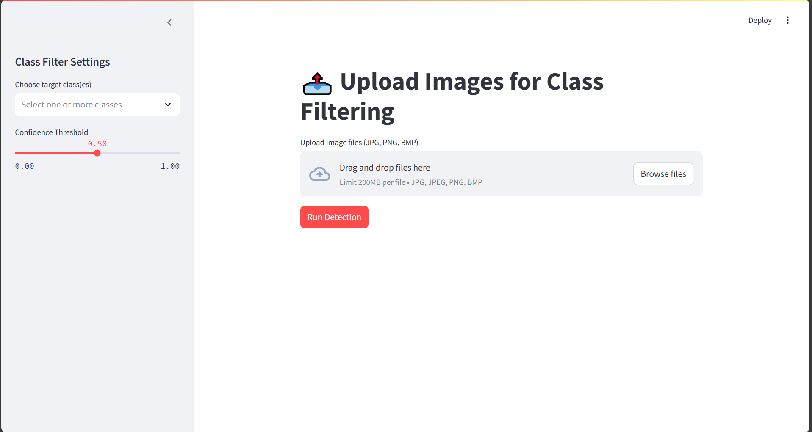

# 🧠 Image Class Finder with YOLO

This is a Streamlit web app that allows users to **upload images** and **automatically filter them based on object classes** using a pretrained YOLOv11 model. It helps identify which uploaded images contain specific objects like "dog", "car", "person", etc., from the COCO dataset.

---

## 🎬 Demo



---

## 🚀 Features

- Upload multiple images (JPG, PNG, BMP).
- Select one or more object classes (COCO-based).
- Filter and display only images containing selected objects.
- Powered by [Ultralytics YOLOv11](https://github.com/ultralytics/ultralytics).
- Live progress and matched results.

---

## 🧰 Requirements

- Python 3.11
- `ultralytics`
- `streamlit`
- `Pillow`

Install dependencies:

```bash
pip install -r requirements.txt
```
or just
```bash
uv run main.py
```

## Author

**[Mert Akgül]** – *Computer Vision & AI Enthusiast*  
[Portfolio](https://medium.com/@Mert.A/list/projects-6f9bb92a3c21) | [Blog](https://medium.com/@Mert.A) | [LinkedIn](https://www.linkedin.com/in/mert-akgül)
